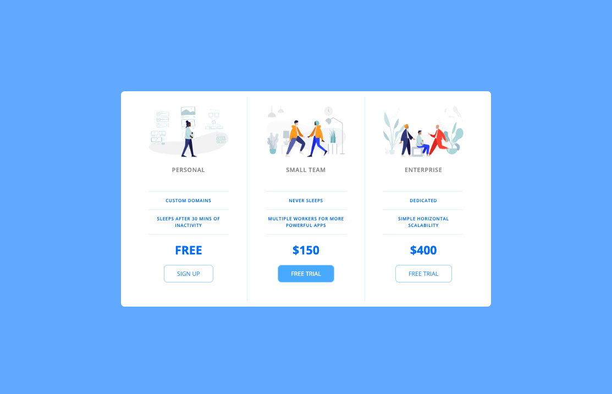
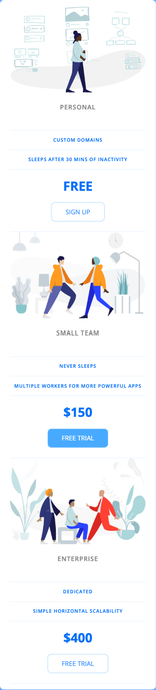

# Udemy Bootcamp - Pricing Panel Project

## Table of contents

- [Overview](#overview)
  - [The activity](#the-activity)
  - [Solution](#solution)
- [My process](#my-process)
  - [Built with](#built-with)
- [Author](#author)

## Overview

### The activity

In this project, I completed a pricing panel through the mobile-first approach. These can be seen in many sites such as Kahoot or API sites offering their services with 1 being the featured, recommended, or most commonly used one.

Users should be able to:
- [X] See mobile version
- [X] See desktop version

### Solution

- Solution URL: [My Solution](https://jennifer-464.github.io/web-dev-bootcamp/4-Price-Table)

 
 

## My Process

### Built with

- Mobile-first approach
- Flexbox
- CSS Reset

## Author

- LinkedIn - [Jennifer](https://www.linkedin.com/in/jennifer464/)
- Frontend Mentor - [@Jennifer-464](https://www.frontendmentor.io/profile/Jennifer-464)
- Portfolio - [Jennifer](https://jennifer-464.github.io/portfolio-gc/)